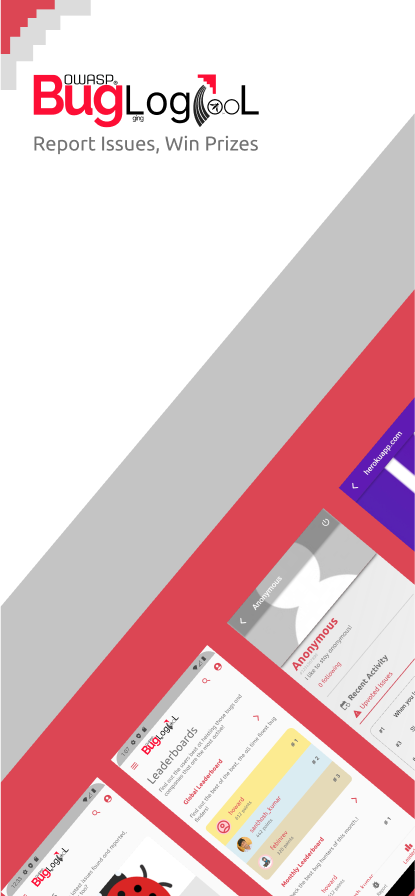

---

layout: col-sidebar
title: OWASP Bug Logging Tool
tags: OWASP, BLT, Internet security, Bug reporting, Responsible disclosure, User rewards, Bughunt programs, Online safety, Vulnerability detection, User engagement
level: 3.5
type: tool
pitch: OWASP BLT is a tool enabling internet users to report all kinds of issues they encounter, thereby improving internet security, with a unique feature of rewarding users for bug reporting and allowing companies to launch their own bug hunting programs, promoting responsible disclosure and fostering a safer online environment.

---

# Introduction

OWASP BLT (Bug Logging Tool) is a powerful tool designed to allow everyone who uses the internet to help improve it. With BLT, users can submit any type of issue they encounter, whether it's a simple design flaw like a button being the wrong color, or a serious security vulnerability. By following responsible disclosure ethics, BLT helps to ensure that reported issues are addressed in a timely and appropriate manner.

One unique feature of BLT is that it rewards users for reporting bugs. As users report more issues, they earn more points, which can be verified for extra points. Additionally, companies and organizations can get involved with BLT and launch their own bug bounty programs with prize pools. This not only incentivizes users to report bugs but also encourages companies to actively seek out and address vulnerabilities before they can be exploited.

Overall, OWASP BLT is an important tool for improving internet security and promoting responsible disclosure practices. By allowing anyone to report issues, rewarding users for their contributions, and providing a platform for companies to launch bug bounty programs, BLT empowers individuals and organizations to work together towards a safer and more secure online environment.

---

# How it Works

OWASP BLT is a bug logging tool that allows users to report issues and get points, and companies are held accountable. Testers can win money through company-sponsored Bug Bounties, tips, or the Grand Prize/Jackpot. Organizations can keep their customers happy by giving them a consistent bug-free user experience.

---

# Latest Releases

| Version | Release Date | Highlights |
|---------|--------------|------------|
| **v2.1** | November 2025 | Dark mode, bounty payouts, security labs, hackathon features, UI/UX improvements |
| **v2.0** | March 2025 | Major redesign, notification system, Slack integration, BACON rewards, security labs |
| **v1.5** | June 2024 | AI chatbot, website monitoring, cryptocurrency payments |
| **v1.4** | March 2024 | New homepage, sidebar navigation, improved UI/UX |

For full release notes, visit [GitHub Releases](https://github.com/OWASP-BLT/BLT/releases).

---

# Screenshots

## App

     
     &emsp;
     &emsp;
     &emsp;
     &emsp;
      

---

# Contributors

The OWASP Bug Logging Tool Project is a community-driven initiative that relies on the contributions of volunteers from all over the world. These dedicated individuals generously donate their time and expertise to help improve the security of the internet for everyone.

We are proud of the diverse and dedicated community that has grown around this project. We recognize that each contributor brings their unique perspective, skills, and experiences to the table, and we value each and every one of them.

At OWASP, we strive to foster a welcoming and inclusive environment where everyone can contribute and thrive. We believe that diversity is essential to the success of the OWASP BLT Project, and we are committed to providing a safe and supportive space for all our volunteers.

View all contributors: [https://github.com/OWASP-BLT/BLT/graphs/contributors](https://github.com/OWASP-BLT/BLT/graphs/contributors)

---

# Roadmap

View the project roadmap: [https://github.com/orgs/OWASP-BLT/projects/2/views/5](https://github.com/orgs/OWASP-BLT/projects/2/views/5)

---

# Contributing

Learn how to contribute: [https://blt.owasp.org/contribute/](https://blt.owasp.org/contribute/)

---

# Project History

## Recent Milestones

- **November 2025:** BLT v2.1 released with dark mode, security labs, and hackathon features
- **March 2025:** BLT v2.0 released with major redesign and new features
- **June 2024:** BLT v1.5 released with AI chatbot integration
- **May 2023:** BLT becomes an OWASP production project
- **May 2023:** BLT participating in GSoC 2023
- **September 2016:** BLT becomes an official OWASP project
- **July 2016:** The project was submitted to be an OWASP project
- **Jan 2012:** The idea was born to have a website to make a game out of bug finding

## Google Summer of Code Participation

BLT has participated in the Google Summer of Code program:

- [GSoC 2025](https://owasp.org/www-community/initiatives/gsoc/gsoc2025ideas)
- [GSoC 2024](https://owasp.org/www-community/initiatives/gsoc/gsoc2024ideas)
- [GSoC 2023](https://owasp.org/www-community/initiatives/gsoc/gsoc2023ideas)
- [GSoC 2022](https://owasp.org/www-community/initiatives/gsoc/gsoc2022ideas)
- [GSoC 2021](https://owasp.org/www-community/initiatives/gsoc/gsoc2021ideas)
- [GSoC 2020](https://owasp.org/www-community/initiatives/gsoc/gsoc2020ideas)

---

# Frequently Asked Questions (FAQs)

**1. What is OWASP BLT?**

OWASP BLT (Bug Logging Tool) is a free and open-source web-based application that allows anyone to report software or hardware bugs found on any website.

**2. How does OWASP BLT work?**

Users can submit a bug report through the BLT platform, and they can earn points for each bug they find. Companies can launch their own Bug Bounties and reward users for finding issues on their websites. Bug hunters can win money through company-sponsored Bug Bounties, tips, or the Grand Prize/Jackpot.

**3. Who can use OWASP BLT?**

OWASP BLT is available for anyone to use, regardless of their technical background.

**4. How do I report an issue using OWASP BLT?**

To report an issue using OWASP BLT:
- Create a user account to log into BLT
- Describe the software or hardware bug you found
- Attach a screenshot of the bug
- Submit the information

**5. How can I win rewards for reporting bugs?**

You can win rewards by participating in company-sponsored Bug Bounties, where you can earn prize money. The prize pool can include a Grand Prize/Jackpot, and in some cases, each bug is worth a specific amount based on what the company sets.

**6. How are bugs verified?**

Bugs are verified through a community-driven process, where other users can verify the issue, and the company can confirm the validity of the bug report.

**7. What kind of bugs can be reported?**

Any kind of software or hardware bug found on a website can be reported, including security vulnerabilities, broken links, incorrect display of content, and more.

**8. Can organizations launch bug bounty programs?**

Yes, organizations can launch their own Bug Bounties and reward users for finding issues on their websites.

**9. Is OWASP BLT free to use?**

Yes, OWASP BLT is free and open-source software licensed under the GNU Affero General Public License 3.0.

**10. How can I get involved with the project?**

Contributions are always welcome! You can:
- Check out the [Contribution Guidelines](https://blt.owasp.org/contribute/)
- Join the [OWASP Slack Channel](https://owasp.slack.com/messages/project-blt)
- Contribute skills like research, writing, graphic design, or development

**11. Can non-technical people participate?**

Yes! The project needs different skills including researchers, writers, graphic designers, and project administrators.

---

# Using AI Tools for Contributing

AI tools like ChatGPT can assist with BLT project contributions:

**Development:**
- Code reviews and troubleshooting for Django, Flutter, or JavaScript
- Generating boilerplate code and documentation
- Quick prototyping

**Testing:**
- Brainstorming test cases
- Writing test scripts

**Project Management:**
- Generating progress reports
- Drafting communications

**Note:** AI tools are assistants, not replacements for human judgment. Always review suggestions and ensure compliance with relevant policies.

---

# Donate

Donating to OWASP BLT is a great way to support the project and ensure its ongoing development. Your donation will be used to cover expenses related to hosting the project's infrastructure, organizing events, and promoting the project to a wider audience. By donating, you're helping to keep OWASP BLT free and open-source for everyone to use, and you're supporting the growth of the project. Every contribution, no matter how small, is greatly appreciated and goes a long way in helping the project reach its full potential.

[Donate Here](https://owasp.org/donate?reponame=www-project-bug-logging-tool&title=OWASP+Bug+logging+tool)

[Category:OWASP Project](Category:OWASP_Project "wikilink")

[Category:OWASP Builders](Category:OWASP_Builders "wikilink")

[Category:OWASP Defenders](Category:OWASP_Defenders "wikilink")

[Category:OWASP Tool](Category:OWASP_Tool "wikilink")

